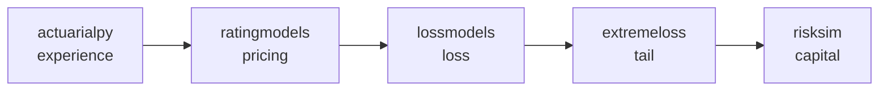

# OpenActuarial

**Open-source actuarial tooling for Python.** A small, composable ecosystem for
experience analysis, pricing, loss modeling, and capital — built on a shared
core, with light dependencies (numpy / pandas) throughout.

```bash
pip install actuarialpy        # or any package below
```

## The ecosystem

<div class="grid cards" markdown>

-   __actuarialpy__ · the core

    ---

    Experience analysis and the shared primitives: PMPM and loss-ratio metrics,
    trend, completion, seasonality, **credibility**, **financial math**, and
    **exposure**. Everything else builds on it.

    [:octicons-arrow-right-24: Documentation](actuarialpy.md)

-   __ratingmodels__ · pricing

    ---

    Group rate build-up and indication: manual and experience rating, an
    auditable build-up engine, GLM relativities, retention gross-up, and renewal.

    [:octicons-arrow-right-24: Documentation](ratingmodels.md)

-   __lossmodels__ · loss modeling

    ---

    Loss-distribution modeling: severity and frequency fitting, and aggregate
    loss.

    [:octicons-arrow-right-24: Documentation](lossmodels.md)

-   __extremeloss__ · tails

    ---

    Extreme-value tail estimation: peaks-over-threshold / GPD and large-claim
    loading.

    [:octicons-arrow-right-24: Documentation](extremeloss.md)

-   __risksim__ · capital

    ---

    Portfolio Monte Carlo simulation and risk measures.

    [:octicons-arrow-right-24: Documentation](risksim.md)

</div>

## How they fit together



`actuarialpy` is the foundation. The cross-cutting primitives — credibility,
trend, financial mathematics, exposure — live there **once**, and the other
packages depend on it rather than re-implementing them. That shared core is what
makes these a system rather than five overlapping scripts.

## A workflow across the ecosystem

The packages are designed to compose. Here credibility comes from the core and
the rate build-up and indication come from `ratingmodels`:

```python
import actuarialpy as ap
import ratingmodels as rm

# core: credibility for the group's own experience
z = ap.limited_fluctuation_z(exposure=96_000, full_credibility_standard=120_000)

# pricing: build the manual rate, blend against experience, and indicate
manual = rm.ManualRate(base_pmpm=480, factors={"area": 1.05, "industry": 0.97})

indication = rm.RateIndication(
    experience_claims_pmpm=512,
    manual_claims_pmpm=manual.claims_pmpm(),
    credibility=z,
    current_rate=560,
    target_loss_ratio=0.85,
)

print(indication.indicated_rate_change())       # the indicated rate change
print(indication.rate_change_decomposition())   # why it moved, reconciled exactly
```

The same pattern extends across the stack: develop and trend experience in
`actuarialpy`, price in `ratingmodels`, model the loss distribution in
`lossmodels`, estimate the tail in `extremeloss`, and aggregate to capital in
`risksim`.

## Getting started

Pick the package for your task from the grid above, `pip install` it, and follow
its guide. Each package has its own quickstart and full API reference, all under
[openactuarial.org](https://openactuarial.org).