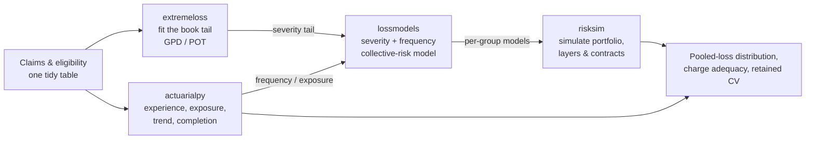

# How they fit together

The four libraries are separate installs, but they are designed to compose. A typical
large-claim and pooling analysis uses all four:

The division of labor:

- **actuarialpy** owns the deterministic, exposure-based side — member-months, loss
  ratios, PMPM, trend, completion/development, and the retained-experience primitives
  (`retained_cv`, `retention_for_target_cv`).
- **extremeloss** estimates the heavy tail. A single block is usually too small to own
  a credible tail, so you fit one book-wide GPD and apply its *shape* across groups.
- **lossmodels** turns a frequency assumption and a severity (whose tail can come from
  `extremeloss`) into a collective-risk model for an aggregate loss.
- **risksim** simulates a portfolio of those models and applies reinsurance layers and
  contracts, yielding the pooled-loss distribution and exceedance probabilities.

## Design principle

The libraries are **general mathematics**, kept public and reusable. They carry no
domain data and no proprietary conventions. The data they run on — and any
organization-specific configuration — stays separate, in your own code. The same
library call runs on a synthetic demo dataset or on real claims; only the input
changes. This is what lets the math be open while the data stays wherever it belongs.

## Integration between packages

When more than one package is installed, optional adapter functions connect them:

- `extremeloss.fit_pot_from_lossmodel` / `sample_lossmodel` — fit or sample a tail
  against a `lossmodels` severity.
- `extremeloss.losses_from_risksim` / `tail_summary_from_risksim` — pull a simulated
  loss vector from a `risksim` result and analyze its tail.

These are optional: each library works standalone, and imports the others only where one
of these integrations is explicitly used.
